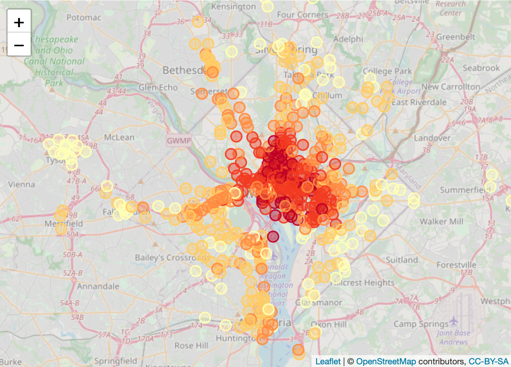
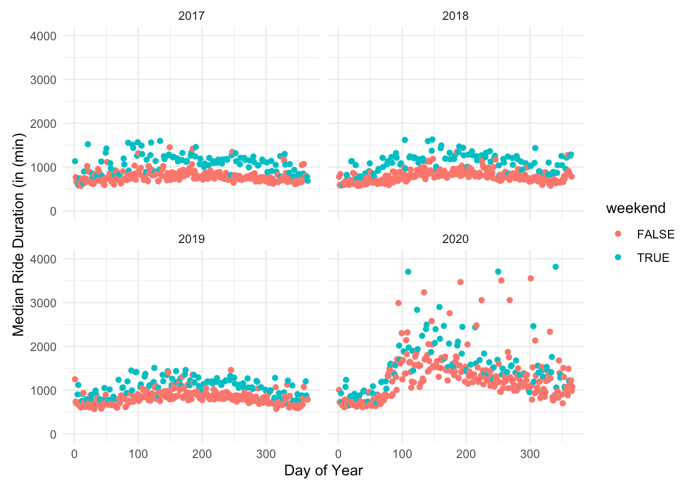
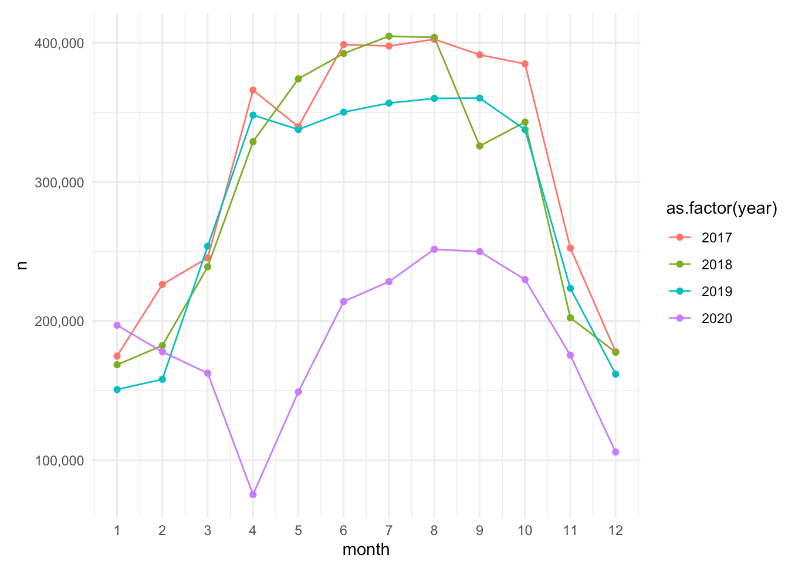
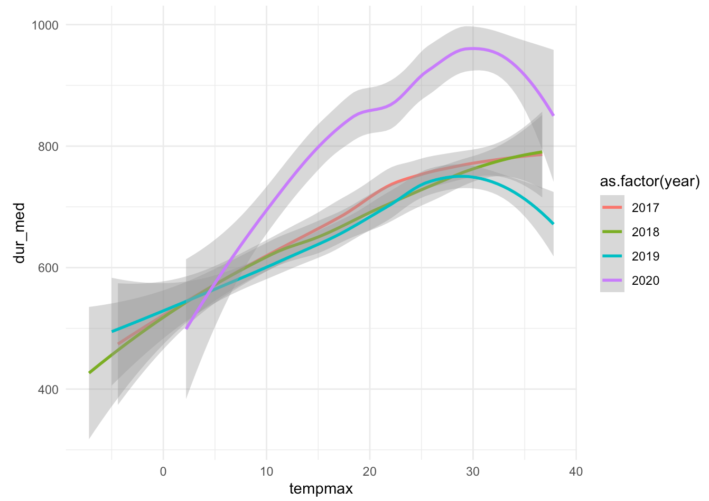

---
aliases:
- work
author:
  name: Tom Mosher
date: "2023-03-05"
title: Selected Works
pageRef: works
---

Here's a sampling of some public work, going back in time.




(link coming soon) A Shiny app to explore daily ride and station-level bikeshare data.




  
  
  
  


See the full <a href="https://rpubs.com/avrsagashi/1004914">latest findings here</a>.



Realizing I needed a more elegant solution to the growing mess of code, I made this.





A slow and steady meditation on potential effects of the Covid-19 Pandemic on aggregate bikeshare patterns in Washington, DC.  



Functions our team used that grew into a (somewhat-) formalized package.




Some small and humble contributions to a fantastic team effort on global laborforce harmonization.




An interactive Shiny App (with heavy custom HTML/CSS) to explore the math and mechanics behind vaccine efficacy rates.




